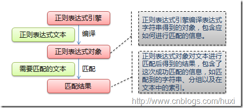

# Python正则表达式

## 1. 正则表达式基础

### 1.1 简单介绍与基础语法
正则表达式并不是Python的一部分。正则表达式是用于处理字符串的强大工具，拥有自己独特的语法以及一个独立的处理引擎，效率上可能不如str自带的方法，但功能十分强大。得益于这一点，在提供了正则表达式的语言里，正则表达式的语法都是一样的，区别只在于不同的编程语言实现支持的语法数量不同；但不用担心，不被支持的语法通常是不常用的部分。如果已经在其他语言里使用过正则表达式，只需要简单看一看就可以上手了。

下图展示了使用正则表达式进行匹配的流程：


下图列出了Python支持的正则表达式元字符和语法：   


### 1.2 数量词的贪婪模式与非贪婪模式
正则表达式通常用于在文本中查找匹配的字符串。Python里数量词默认是贪婪的（在少数语言里也可能是默认非贪婪），总是尝试匹配尽可能多的字符；非贪婪的则相反，总是尝试匹配尽可能少的字符。例如：正则表达式"ab*"如果用于查找"abbbc"，将找到"abbb"。而如果使用非贪婪的数量词"ab*?"，将找到"a"。

### 1.3 反斜杠的困扰
与大多数编程语言相同，正则表达式里使用"\"作为转义字符，这就可能造成反斜杠困扰。假如你需要匹配文本中的字符"\"，那么使用编程语言表示的正则表达式里将需要4个反斜杠"\\\\"：前两个和后两个分别用于在编程语言里转义成反斜杠，转换成两个反斜杠后再在正则表达式里转义成一个反斜杠。Python里的原生字符串很好地解决了这个问题，这个例子中的正则表达式可以使用r"\\"表示。同样，匹配一个数字的"\\d"可以写成r"\d"。有了原生字符串，你再也不用担心是不是漏写了反斜杠，写出来的表达式也更直观。

### 1.4 匹配模式
正则表达式提供了一些可用的匹配模式，比如忽略大小写、多行匹配等，这部分内容将在Pattern类的工厂方法re.compile(pattern[, flags])中一起介绍。

## 2. re模块

### 2.1 开始使用re
Python通过re模块提供对正则表达式的支持。使用re的一般步骤是先将正则表达式的字符串形式编译为Pattern实例，然后使用Pattern实例处理文本并获得匹配结果（一个Match实例），最后使用Match实例获得信息，进行其他的操作。
```python
# !/usr/bin/python3
# encoding: utf-8

import re

def pattern_hello():
    dist_str = 'hello world!'

    # 下面两行代码 等效于 match = re.match(r'hello', dist_str)
    # 将正则表达式编译成Pattern对象
    pattern = re.compile(r'hello')
    # 使用Pattern匹配文本，或得匹配结果，无法匹配则返回None
    match = pattern.match(dist_str)

    if match:
        print(match.group())
    # output：
    # hello
```

**re.compile(strPattern[, flag]):**

这个方法是Pattern类的工厂方法，用于将字符串形式的正则表达式编译为Pattern对象。 第二个参数flag是匹配模式，取值可以使用按位或运算符'|'表示同时生效，比如re.I | re.M。
另外，你也可以在regex字符串开头指定模式，此时匹配模式字母不区分大小写，比如re.compile('pattern', re.I | re.M)与re.compile('(?im)pattern')是等价的。 
可选值有：

- I(IGNORECASE): 忽略大小写（括号内是完整写法，下同）
- M(MULTILINE): 多行模式，改变'^'和'$'的行为（参见上图）
- S(DOTALL): 点任意匹配模式，改变'.'的行为
- L(LOCALE): 使预定字符类 \w \W \b \B \s \S 取决于当前区域设定
- U(UNICODE): 使预定字符类 \w \W \b \B \s \S \d \D 取决于unicode定义的字符属性
- X(VERBOSE): 详细模式。这个模式下正则表达式可以是多行，忽略空白字符，并可以加入注释。以下两个正则表达式是等价的：

```python
import re
a = re.compile(r"""\d +  # the integral part
                   \.    # the decimal point
                   \d *  # some fractional digits""", re.X)
b = re.compile(r"\d+\.\d*")
```

### 2.2 Match
Match对象是一次匹配的结果，包含了很多关于此次匹配的信息，可以使用Match提供的可读属性或方法来获取这些信息。

**属性：**

    1. string: 匹配时使用的文本。
    2. re: 匹配时使用的Pattern对象。
    3. pos: 文本中正则表达式开始搜索的索引。值与Pattern.match()和Pattern.seach()方法的同名参数相同。
    4. endpos: 文本中正则表达式结束搜索的索引。值与Pattern.match()和Pattern.seach()方法的同名参数相同。
    5. lastindex: 最后一个被捕获的分组在文本中的索引。如果没有被捕获的分组，将为None。
    6. lastgroup: 最后一个被捕获的分组的别名。如果这个分组没有别名或者没有被捕获的分组，将为None。

**方法：**

    1. group([group1, …]): 
    获得一个或多个分组截获的字符串；指定多个参数时将以元组形式返回。group1可以使用编号也可以使用别名；编号0代表整个匹配的子串；不填写参数时，返回group(0)；没有截获字符串的组返回None；截获了多次的组返回最后一次截获的子串。
    
    2. groups([default]): 
    以元组形式返回全部分组截获的字符串。相当于调用group(1,2,…last)。default表示没有截获字符串的组以这个值替代，默认为None。
    
    3. groupdict([default]): 
    返回以有别名的组的别名为键、以该组截获的子串为值的字典，没有别名的组不包含在内。default含义同上。
    
    4. start([group]): 
    返回指定的组截获的子串在string中的起始索引（子串第一个字符的索引）。group默认值为0。
    
    5. end([group]): 
    返回指定的组截获的子串在string中的结束索引（子串最后一个字符的索引+1）。group默认值为0。
    
    6. span([group]): 
    返回(start(group), end(group))。
    
    7. expand(template): 
    将匹配到的分组代入template中然后返回。template中可以使用\id或\g<id>、\g<name>引用分组，但不能使用编号0。\id与\g<id>是等价的；但\10将被认为是第10个分组，如果你想表达\1之后是字符'0'，只能使用\g<1>0。

```python
import re
def show_match_properties():
    match = re.match(r'(\w+) (\w+)(?P<sign>.*)', 'hello world!!!')

    print('match.string:', match.string)
    print('match.re:', match.re)
    print('match.pos:', match.pos)
    print('match.endpos:', match.endpos)
    print('match.lastindex:', match.lastindex)
    print('match.lastgroup:', match.lastgroup)

    print('match.group():', match.group())
    print('match.group(1, 2):', match.group(1, 2))
    print('match.groups():', match.groups())
    print('match.groupdict():', match.groupdict())
    print('match.start(2):', match.start(2))
    print('match.end(2):', match.end(2))
    print('match.span(2):', match.span(2))
    print(r"match.expand(r'\3\2 \1'):", match.expand(r'\3\2 \1'))

    # output:
    # match.string: hello world!
    # match.re: <_sre.SRE_Pattern object at 0x016E1A38>
    # match.pos: 0
    # match.endpos: 12
    # match.lastindex: 3
    # match.lastgroup: sign
    # match.group(): 'hello world!'
    # match.group(1,2): ('hello', 'world')
    # match.groups(): ('hello', 'world', '!')
    # match.groupdict(): {'sign': '!'}
    # match.start(2): 6
    # match.end(2): 11
    # match.span(2): (6, 11)
    # match.expand(r'\2 \1\3'): world hello!
```

### 2.3 Pattern

Pattern对象是一个编译好的正则表达式，通过Pattern提供的一系列方法可以对文本进行匹配查找。

Pattern不能直接实例化，必须使用re.compile()进行构造。

Pattern提供了几个可读属性用于获取表达式的相关信息：

    1. pattern: 编译时用的表达式字符串。
    2. flags: 编译时用的匹配模式。数字形式。
    3. groups: 表达式中分组的数量。
    4. groupindex: 以表达式中有别名的组的别名为键、以该组对应的编号为值的字典，没有别名的组不包含在内。

```python
import re
def show_pattern_properties():
    pat = re.compile(r'(\w+) (\w+)(?P<sign>.*)', re.DOTALL)

    print('pat.pattern:', pat.pattern)
    print('pat.flags:', pat.flags)
    print('pat.groups:', pat.groups)
    print('pat.groupindex:', pat.groupindex)

    # output:
    # pat.pattern: (\w+)(\w +)(?P < sign >.*)
    # pat.flags: 48
    # pat.groups: 3
    # pat.groupindex: {'sign': 3}
```

**实例方法[ | re模块方法]：**

    1. match(string[, pos[, endpos]]) | re.match(pattern, string[, flags]): 
    这个方法将从string的pos下标处起尝试匹配pattern；如果pattern结束时仍可匹配，则返回一个Match对象；如果匹配过程中pattern无法匹配，或者匹配未结束就已到达endpos，则返回None。 
    pos和endpos的默认值分别为0和len(string)；re.match()无法指定这两个参数，参数flags用于编译pattern时指定匹配模式。 
    注意：这个方法并不是完全匹配。当pattern结束时若string还有剩余字符，仍然视为成功。想要完全匹配，可以在表达式末尾加上边界匹配符'$'。 
    示例参见2.1小节。
    
    2. search(string[, pos[, endpos]]) | re.search(pattern, string[, flags]): 
    这个方法用于查找字符串中可以匹配成功的子串。从string的pos下标处起尝试匹配pattern，如果pattern结束时仍可匹配，则返回一个Match对象；若无法匹配，则将pos加1后重新尝试匹配；直到pos=endpos时仍无法匹配则返回None。
    pos和endpos的默认值分别为0和len(string))；re.search()无法指定这两个参数，参数flags用于编译pattern时指定匹配模式。 
```python
import re
def pattern_search():
    # 将正则表达式编译成Pattern对象
    pattern = re.compile(r'world')

    # 使用search()查找匹配的子串，不存在能匹配的子串时将返回None
    # 这个例子中使用match()无法成功匹配
    match = pattern.search('hello world!')
    if match:
        # 使用Match获得分组信息
        print(match.group())

    # output:
    # world
```
    3. split(string[, maxsplit]) | re.split(pattern, string[, maxsplit]): 
    按照能够匹配的子串将string分割后返回列表。maxsplit用于指定最大分割次数，不指定将全部分割。
```python
import re
def pattern_split():
    """
    按照能够匹配的子串将string分割后返回列表
    maxsplit用于指定最大分割次数，不指定将全部分割
    """
    p = re.compile(r'\d+')
    print(p.split('one1two2three3four4'))

    # output:
    # ['one', 'two', 'three', 'four', '']
```
    4. findall(string[, pos[, endpos]]) | re.findall(pattern, string[, flags]): 
    搜索string，以列表形式返回全部能匹配的子串。
```python
import re
def pattern_findall():
    """
    搜索string，以列表形式返回全部能匹配的子串
    """
    p = re.compile(r'\d+')
    print(p.findall('one1two2three3four4'))

    # output
    # ['1', '2', '3', '4']
```
    5. finditer(string[, pos[, endpos]]) | re.finditer(pattern, string[, flags]): 
    搜索string，返回一个顺序访问每一个匹配结果（Match对象）的迭代器。
```python
import re
def finditer():
    """
    搜索string，返回一个顺序访问每一个匹配结果（Match对象）的迭代器
    """
    p = re.compile(r'\d+')
    for m in p.finditer('one1two2three3four4'):
        print(m.group())

    # output
    # 1 2 3 4
```
    6. sub(repl, string[, count]) | re.sub(pattern, repl, string[, count]): 
    使用repl替换string中每一个匹配的子串后返回替换后的字符串。 
    当repl是一个字符串时，可以使用\id或\g<id>、\g<name>引用分组，但不能使用编号0。 
    当repl是一个方法时，这个方法应当只接受一个参数（Match对象），并返回一个字符串用于替换（返回的字符串中不能再引用分组）。 
    count用于指定最多替换次数，不指定时全部替换。
```python
import re
def pattern_sub():
    p = re.compile(r'(\w+) (\w+)')
    s = 'i say, hello world!'

    print(p.sub(r'\2 \1', s))
    print(p.sub(lambda m: m.group(1).title() + ' ' + m.group(2).title(), s))

    # output
    # say I, world hello!
    # I Say, Hello World!
```
    7.subn(repl, string[, count]) |re.sub(pattern, repl, string[, count]): 
    返回 (sub(repl, string[, count]), 替换次数)。 
```python
import re
def pattern_subn():
    """
    返回 (sub(repl, string[, count]), 替换次数)
    """
    p = re.compile(r'(\w+) (\w+)')
    s = 'i say, hello world!'

    print(p.subn(r'\2 \1', s))
    print(p.subn(lambda m: m.group(1).title() + ' ' + m.group(2).title(), s))

    # output
    # ('say i, world hello!', 2)
    # ('I Say, Hello World!', 2)
```


